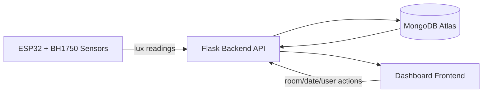

# Indoor Light Notification System

[](https://iot-light-sensor-zumx.onrender.com/api/docs)
[](https://iot-light-sensor-zumx.onrender.com/api/docs)
[](https://www.python.org/)
[](https://flask.palletsprojects.com/)

## Project Overview

This project is an end-to-end indoor light monitoring prototype using ESP32 + BH1750 sensors, a Flask backend, MongoDB storage, and a live dashboard UI.

Core capabilities:
- Collect lux readings from IoT sensors.
- Track daily room ON duration (`onSeconds`).
- Visualize current and historical usage in dashboard charts.
- Persist usage and sensor snapshots in MongoDB.

## Prototype (Dashboard) and Quick How-To

Use the dashboard as the prototype interface for real-time monitoring and usage analytics:
- Open the app at `https://iot-light-sensor.onrender.com/`.
- Watch live sensor badges and room cards for ON/OFF status.
- Use room/date selectors to inspect stored MongoDB usage rows.
- Use the Today and monthly cards to inspect current and aggregate behavior.

Prototype preview:


Prototype references:
- Interactive system diagram page: `dashboard/diagram.html`
- Dashboard template source: `dashboard/templates/dashboard.html`

## Architecture Diagram

High-level data flow:



Supporting architecture docs:
- `app/architect/diagrams/readme.md`
- `app/architect/system/readme.md`
- `app/architect/data/database-schema.md`

## Run the Application (Step-by-Step)

1. **Clone and enter project**
   ```bash
   git clone <repo-url>
   cd IoT-Light-Sensor
   ```

2. **Create environment and install dependencies**
   ```bash
   cd dashboard
   python -m venv .venv
   source .venv/bin/activate
   pip install -r requirements.txt
   ```

3. **Configure environment**
   Create/update `dashboard/.env`:
   ```env
   MONGO_URI=<your-mongodb-uri>
   DB_NAME=light_sensor_db
   ```

4. **Run backend**
   ```bash
   python app.py
   ```

5. **Open dashboard**
   Visit:
   - `https://iot-light-sensor.onrender.com/` (dashboard)
   - `http://127.0.0.1:5001/api/docs` (Swagger)

6. **Optional API check**
   ```bash
   curl http://127.0.0.1:5001/api/usage/statistics
   ```

## Known Limitations

- Dashboard behavior depends on MongoDB connectivity; if DB is unavailable, several live widgets show empty/default values.
- The Flask app is currently run with development server settings (`python app.py`), not production WSGI deployment.
- Command delivery to physical devices requires device-side polling/ack handling to fully guarantee ON/OFF command execution.
- Some counters rely on mixed client/server update timing and may briefly lag during network or API throttling events.
- Browser local state can affect display continuity across sessions unless explicitly reset.

## Tech Stack

- **Backend**: Flask (Python 3.9+)
- **Database**: MongoDB Atlas
- **Frontend**: HTML/CSS/JS (Chart.js)
- **Deployment**: Render
- **API Docs**: Swagger / OpenAPI

## License

This project is part of SE4CPS coursework.
