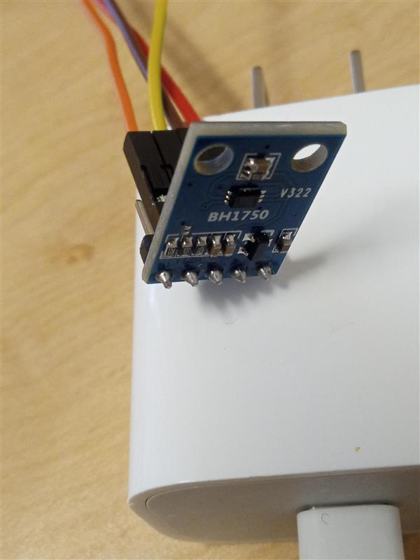
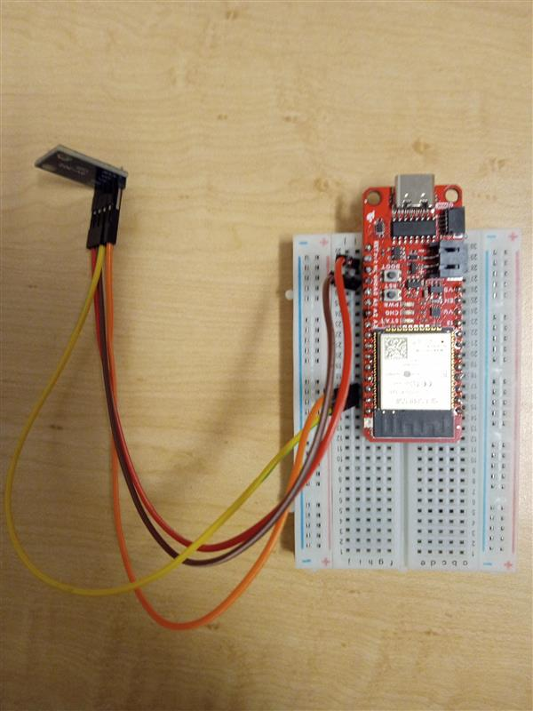
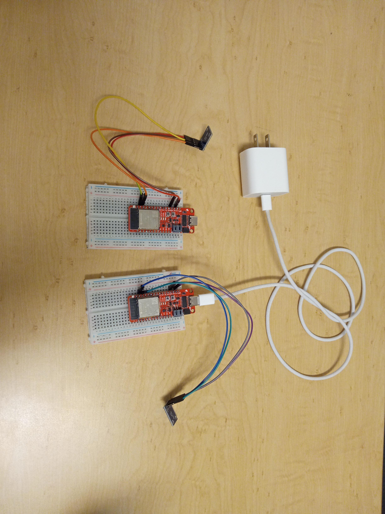

# Indoor Light Notification System

[](https://iot-light-sensor-zumx.onrender.com/api/docs)
[](https://iot-light-sensor-zumx.onrender.com/api/docs)
[](https://www.python.org/)
[](https://flask.palletsprojects.com/)

This repository contains a small, end to end indoor monitoring system that tracks room light usage, visualizes the current state, and notifies users when lights are left on for too long.

---

## 🚀 Quick Links

- **[Live API Documentation](https://iot-light-sensor-zumx.onrender.com/api/docs)** - Interactive Swagger UI
- **[Production API](https://iot-light-sensor-zumx.onrender.com)** - Live endpoint
- **[GitHub Pages](https://se4cps.github.io/IoT-Light-Sensor/)** - Project website

---

## Project Goals

- Upstream indoor light sensor data to a backend service  
- Display the light status of a room on a dashboard  
- Notify the user if a light remains **ON for more than 12 hours**

---

## 📡 Embedded Hardware
***ESP32 Microcontroller w/ BH1750 Light Sensor***

ESP32 (SparkFun Thing) on a half-size breadboard connected via I²C to a BH1750 ambient light sensor (V322). Measures lux at 16-bit resolution over VCC, GND, SDA, SCL.

| | | |
|:---:|:---:|:---:|
|  |  |  |
| BH1750 module with I²C header pins and color-coded jumper wires. | ESP32 on breadboard wired to BH1750, ready for USB firmware upload. | Two-sensor deployment powered from a single USB wall adapter — used for weekend long-run tests. |

***Sensor Type***

Of the 4 sensor types (Photodiode, Phototransistor, LDR, Digital Lux), we chose Digital Lux for the following benefits:
- High accuracy w/ calibrated, noise resistant digital measurements
- Fairly low power consumption
- Minimal circuit complexity out of all sensor types for easy integration, maintenance, and long-term operation
- Measures lux for analyzing light in a room

Click on the following link to learn more about the differences between sensor types: [Light Sensor Types & Characteristics](https://docs.google.com/document/d/1zIgJxN_gNXGTvkLemSUc5l2nPyyrzfW7cB-apdO-95M/edit?usp=sharing)

***WiFi Setup***

To set up the WiFi for the ESP32 microcontroller, the following was required:
- MAC Address
- SSID
- Password

```C++
#include <WiFi.h>

void setup() {
  Serial.begin(115200);
  delay(2000);

  uint8_t mac[6];
  WiFi.macAddress(mac);

  Serial.print("WiFi MAC: ");
  for (int i = 0; i < 6; i++) {
    if (mac[i] < 16) Serial.print("0");
    Serial.print(mac[i], HEX);
    if (i < 5) Serial.print(":");
  }
  Serial.println();

  int n = WiFi.scanNetworks();
  bool found = false;

  for (int i = 0; i < n; i++) {
    if (WiFi.SSID(i) == "PacDeviceReg") {
      found = true;
      Serial.println("PacDeviceReg FOUND");
      Serial.print("RSSI: ");
      Serial.println(WiFi.RSSI(i));
      Serial.print("Channel: ");
      Serial.println(WiFi.channel(i));
      Serial.print("Encryption type: ");
      Serial.println(WiFi.encryptionType(i));
    }
  }

  if (!found) {
    Serial.println("PacDeviceReg NOT FOUND");
  }
}

void loop() {}
```
The team had worked with the University of the Pacific's IT team to be given the permission and information needed to successfully.

***[WIP] Over-The-Air (OTA) Functionality***

The ESP32 supports over-the-air capabilities, allowing the embedded device to update wirelessly using an internet connection. This is not currently implemented, but we have the necessary tools researched and ready should the project be continued in the future:
- [Arduino IDE Software](https://www.arduino.cc/en/software/)
- OpenSSL Library
- .pem Certificate (File in repository)
- USB Drive to install initial code to ESP32

This webpage goes through setting up OTA step-by-step: [Setting Up ESP32 OTA](https://coolplaydev.com/esp32-ota-update)

---

## 📡 API Documentation

### Base URLs
- **Production**: `https://iot-light-sensor-zumx.onrender.com`
- **Swagger UI**: https://iot-light-sensor-zumx.onrender.com/api/docs

### Quick Test
```bash
curl https://iot-light-sensor-zumx.onrender.com/api/usage/statistics
```

---

## Core Data Model
```json
{
  "meta": {
    "entity": "room_light_event",
    "version": "1.0",
    "source": "indoor light sensor"
  },
  "data": {
    "room_id": "string | integer",
    "light_state": "ON | OFF",
    "timestamp": "ISO-8601"
  }
}
```

---

## Database and Storage

### Collections And Fields:
- sensor_hourly : This collection fetch the snsor data and store it in below fields:


- user_data : Stores the login user details in below format:
 


### Triggers

- trg_INS_daily_usage : This trigger fires when new insert goes to daily_usage collection  
- User_Data_Trg_INS : This trigger fires when new user login to the system

---


## 🏗️ Tech Stack

- **Backend**: Flask 3.1.3, Python 3.9+
- **Database**: MongoDB Atlas
- **Deployment**: Render.com
- **API Documentation**: Swagger/OpenAPI 3.0
- **CI/CD**: GitHub Actions

---

## 📝 License

This project is part of the SE4CPS coursework.
