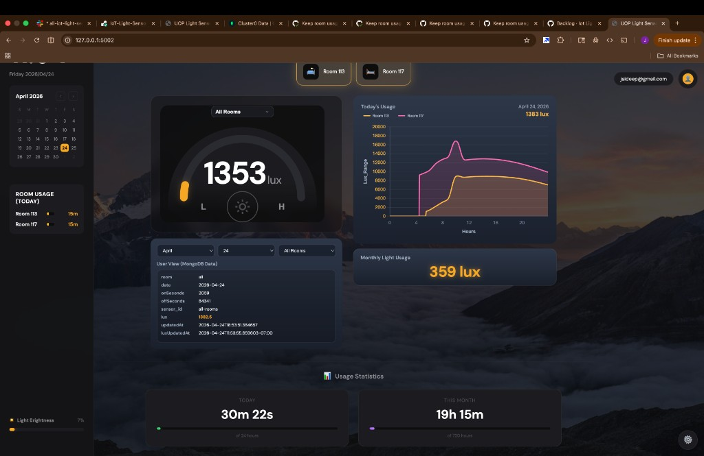
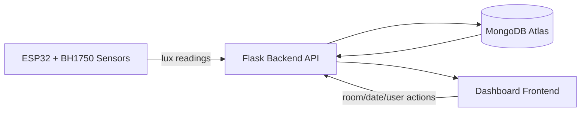

# Indoor Light Notification System

[](https://iot-light-sensor-zumx.onrender.com/api/docs)
[](https://iot-light-sensor-zumx.onrender.com/api/docs)
[](https://www.python.org/)
[](https://flask.palletsprojects.com/)

## Project Overview

This project is an end-to-end indoor light monitoring prototype using ESP32 + BH1750 sensors, a Flask backend, MongoDB storage, and a live dashboard UI.

Core capabilities:
- Collect lux readings from IoT sensors.
- Track daily room ON duration (`onSeconds`).
- Visualize current and historical usage in dashboard charts.
- Persist usage and sensor snapshots in MongoDB.

## Prototype (Dashboard) and Quick How-To

Use the dashboard as the prototype interface for real-time monitoring and usage analytics:
- Open the app at `https://iot-light-sensor.onrender.com/`.
- Watch live sensor badges and room cards for ON/OFF status.
- Use room/date selectors to inspect stored MongoDB usage rows.
- Use the Today and monthly cards to inspect current and aggregate behavior.

Prototype preview:



Prototype references:
- Interactive system diagram page: `dashboard/diagram.html`
- Dashboard template source: `dashboard/templates/dashboard.html`

## Architecture Diagram

High-level data flow:



Supporting architecture docs:
- `app/architect/diagrams/readme.md`
- `app/architect/system/readme.md`
- `app/architect/data/database-schema.md`

## Run the Application (Step-by-Step)

1. **Clone and enter project**
   ```bash
   git clone <repo-url>
   cd IoT-Light-Sensor
   ```

2. **Create environment and install dependencies**
   ```bash
   cd dashboard
   python -m venv .venv
   source .venv/bin/activate
   pip install -r requirements.txt
   ```

3. **Configure environment**
   Create/update `dashboard/.env`:
   ```env
   MONGO_URI=<your-mongodb-uri>
   DB_NAME=light_sensor_db
   ```

4. **Run backend**
   ```bash
   python app.py
   ```

5. **Open dashboard**
   Visit:
   - `https://iot-light-sensor.onrender.com/` (dashboard)
   - `http://127.0.0.1:5001/api/docs` (Swagger)

6. **Optional API check**
   ```bash
   curl http://127.0.0.1:5001/api/usage/statistics
   ```

## Known Limitations

- Dashboard behavior depends on MongoDB connectivity; if DB is unavailable, several live widgets show empty/default values.
- The Flask app is currently run with development server settings (`python app.py`), not production WSGI deployment.
- Command delivery to physical devices requires device-side polling/ack handling to fully guarantee ON/OFF command execution.
- Some counters rely on mixed client/server update timing and may briefly lag during network or API throttling events.
- Browser local state can affect display continuity across sessions unless explicitly reset.

## Tech Stack

- **Backend**: Flask (Python 3.9+)
- **Database**: MongoDB Atlas
- **Frontend**: HTML/CSS/JS (Chart.js)
- **Deployment**: Render
- **API Docs**: Swagger / OpenAPI

## License

This project is part of SE4CPS coursework.
## 📡 Embedded System (ESP32 Light Sensor)
## 📡 Embedded Hardware
***ESP32 Microcontroller w/ BH1750 Light Sensor***

This embedded system collects ambient light data using a sensor connected to an ESP32 and sends it to a backend server over Wi-Fi.

At a high level:

1. The ESP32 reads light intensity (lux) from the sensor
2. Adds a timestamp using NTP
3. Sends the data to the backend API
4. If offline, stores data locally and retries later

**Microcontroller — ESP32 (SparkFun Thing):** Built-in Wi-Fi + Bluetooth, 16 MB flash, 520 KB SRAM, Handles sensor reading + communication

**Sensor — BH1750 (Ambient Light Sensor):** Measures brightness in lux, 16-bit resolution via I²C

### Wiring (I²C)
| Sensor Pin | ESP32 Pin |
| ---------- | --------- |
| VCC        | 3.3V      |
| GND        | GND       |
| SDA        | GPIO16    |
| SCL        | GPIO17    |

  ⚠️ Note: I²C pins are configurable, but this project uses GPIO16 (SDA) and GPIO17 (SCL).


| | | |
|:---:|:---:|:---:|
|  |  |  |
| BH1750 module with I²C header pins and color-coded jumper wires. | ESP32 on breadboard wired to BH1750, ready for USB firmware upload. | Two-sensor deployment powered from a single USB wall adapter — used for weekend long-run tests. |

### 🛠️ Arduino IDE Setup
1. Install ESP32 Support
 (_Arduino IDE → Preferences_)
- Add to Additional Board Manager URLs:https://raw.githubusercontent.com/espressif/arduino-esp32/gh-pages/package_esp32_index.json
2. Install Board Package
(_Tools → Board → Boards Manager_)
- Search: ESP32
- Install: ESP32 by Espressif Systems
3. Select Board
(_Tools → Board → ESP32 Arduino_)
- Choose: ESP32 Dev Module or SparkFun ESP32 Thing
4. Select Port
(_Tools → Port_)
- Mac: /dev/cu.usbserial-xxxx
- Windows: COM3, COM4, etc.
5. Serial Monitor
_(Tools → Serial Monitor)_
- Set baud rate: 115200

### Key Features
**1. Secure API Communication**
- Sends HTTPS requests to:
- ```/api/v1/sensors/data ```(sensor data)
- ``` /api/device/log ``` (error logging)

**2. Offline Storage (SPIFFS)**
- Stores failed readings in ```/data.txt```

**3. OTA Updates**
- Supports Over-the-Air firmware updates
- No physical access required after deployment
```
#include <ArduinoOTA.h>
ArduinoOTA.begin();
ArduinoOTA.handle();
```
***Sensor Type***

Of the 4 sensor types (Photodiode, Phototransistor, LDR, Digital Lux), we chose Digital Lux for the following benefits:
- High accuracy w/ calibrated, noise resistant digital measurements
- Fairly low power consumption
- Minimal circuit complexity out of all sensor types for easy integration, maintenance, and long-term operation
- Measures lux for analyzing light in a room

Click on the following link to learn more about the differences between sensor types: [Light Sensor Types & Characteristics](https://docs.google.com/document/d/1zIgJxN_gNXGTvkLemSUc5l2nPyyrzfW7cB-apdO-95M/edit?usp=sharing)

***WiFi Setup***

To set up the WiFi for the ESP32 microcontroller, the following was required:
- MAC Address
- SSID
- Password

```C++
#include <WiFi.h>

void setup() {
  Serial.begin(115200);
  delay(2000);

  uint8_t mac[6];
  WiFi.macAddress(mac);

  Serial.print("WiFi MAC: ");
  for (int i = 0; i < 6; i++) {
    if (mac[i] < 16) Serial.print("0");
    Serial.print(mac[i], HEX);
    if (i < 5) Serial.print(":");
  }
  Serial.println();

  int n = WiFi.scanNetworks();
  bool found = false;

  for (int i = 0; i < n; i++) {
    if (WiFi.SSID(i) == "PacDeviceReg") {
      found = true;
      Serial.println("PacDeviceReg FOUND");
      Serial.print("RSSI: ");
      Serial.println(WiFi.RSSI(i));
      Serial.print("Channel: ");
      Serial.println(WiFi.channel(i));
      Serial.print("Encryption type: ");
      Serial.println(WiFi.encryptionType(i));
    }
  }

  if (!found) {
    Serial.println("PacDeviceReg NOT FOUND");
  }
}

void loop() {}
```
The team had worked with the University of the Pacific's IT team to be given the permission and information needed to successfully.

***[WIP] Over-The-Air (OTA) Functionality***

The ESP32 supports over-the-air capabilities, allowing the embedded device to update wirelessly using an internet connection. This is not currently implemented, but we have the necessary tools researched and ready should the project be continued in the future:
- [Arduino IDE Software](https://www.arduino.cc/en/software/)
- OpenSSL Library
- .pem Certificate (File in repository)
- USB Drive to install initial code to ESP32

This webpage goes through setting up OTA step-by-step: [Setting Up ESP32 OTA](https://coolplaydev.com/esp32-ota-update)

---

### Example Payload
```
{
  "sensor_id": "esp32_02",
  "room": "living_room",
  "timestamp": "2026-04-22T17:30:00Z",
  "lux": 320
}
```
---
## 📡 API Documentation

### Base URLs
- **Production**: `https://iot-light-sensor-zumx.onrender.com`
- **Swagger UI**: https://iot-light-sensor-zumx.onrender.com/api/docs

### Quick Test
```bash
curl https://iot-light-sensor-zumx.onrender.com/api/usage/statistics
```

---

## Core Data Model
```json
{
  "meta": {
    "entity": "room_light_event",
    "version": "1.0",
    "source": "indoor light sensor"
  },
  "data": {
    "room_id": "string | integer",
    "light_state": "ON | OFF",
    "timestamp": "ISO-8601"
  }
}
```

---

## Database and Storage
The system use MongoDB database, MongoDB allows low cost storage with transactional triggers on INSERT and UPDATE operations. We set triggers on sensor_hourly and user_data collections.

### Collections And Fields:
- sensor_hourly : This collection fetch the lux value from the room and store it in below formats:


- user_data : Stores the login user details in below format:


- Page_Log : Trace application errors from the page, and store with error type code


### Triggers

- trg_INS_daily_usage : This trigger fires when new insert goes to daily_usage collection  
- User_Data_Trg_INS : This trigger fires when new user login to the system

---
## Object-Oriented Programming OOPs Design Approach
Used OOPs approach to ensure relevent code are placed in classes for reuse in the same code file. Eliminiate duplicity through define attributes. The fucntions below ensure the system modularity and extensibility.

- _init_mongo() : This function initialize MongoDB objects
- log_to_page_log() : This function stores error to Page_Log collection
- page_log_collection : Attribute to invoke Page_Log table
- bad_request() : Push Bad request error 400 to Page_Log table
- not_found() : Push Resource not found error 404 to Page_Log table
- internal_error() : Push Internal server error 500 to Page_Log table
- require_json() : Validate that the request body is JSON and contains required fields
- require_mongo() : Return 503 early if the named collection is None
- _pst_now() : Set current datetime in PST
- _today_str() : Set today's date string (YYYY-MM-DD) in PST.
- _daily_usage_aggregate_match() : MongoDB filter for whole-dashboard aggregate timer docs
- _safe_route() : Wrap a route so any exception is logged to Page_Log and returned as 500.
- get_room_statistics() : Weekly and monthly statistics for a specific room.
- get_room_usage() : Get usage for a specific room on a specific date.
- log_admin_access() : Log admin access details to MongoDB.
  
---

## 🏗️ Tech Stack

- **Backend**: Flask 3.1.3, Python 3.9+
- **Database**: MongoDB Atlas
- **Deployment**: Render.com
- **API Documentation**: Swagger/OpenAPI 3.0
- **CI/CD**: GitHub Actions

---

## ⚙️ DevOps & Deployment

### Branch Strategy
- `production` → Default branch, stable, used for deployment (Render)
- All new work must be done in **feature branches**
- No direct commits to `production` allowed

### Development Workflow
```bash
# 1. Start from production
git checkout production
git pull origin production

# 2. Create a feature branch
git checkout -b feature/short-description

# 3. Make changes and test locally
python dashboard/app.py

# 4. Run tests
pytest dashboard/tests/
pytest twin/test_twin_sim.py

# 5. Stage and commit
git add .
git commit -m "Describe your changes clearly"

# 6. Push feature branch
git push -u origin feature/short-description
```

### Pull Request
- Base branch: `production`
- Compare branch: `feature/short-description`
- CI pipeline runs automatically once PR is created
- All tests must pass before merge is allowed

### CI/CD Pipeline
- Pipeline located at `.github/workflows/tests.yml`
- Runs automatically on push and PRs targeting `production`
- Installs dependencies, runs dashboard tests and twin tests

### Branch Protection
- Pull Request required before merging into `production`
- CI checks must pass
- Direct pushes to `production` are blocked

### Deployment
- Hosted on **Render**, deploys from the `production` branch
- Deployment is **manual** — triggered by the DevOps team after every merge
- Live API: https://iot-light-sensor-zumx.onrender.com

### How to Deploy
1. Merge PR into `production`
2. Go to [Render Dashboard](https://dashboard.render.com)
3. Select the `IoT-Light-Sensor` service
4. Click **Manual Deploy** → **Deploy latest commit**
5. Verify the live API is up after deployment

### Team Communication
After creating a PR, notify the team on Slack:
> "Hi team, I created a PR into production for [feature name]. CI passed. Please review and approve."
- Slack channel: `#all-iot-light-sensor`

### Release
- Current version: **v2.0**
- View all releases: [GitHub Releases](../../releases)

### Summary
```
Feature Branch → Pull Request → CI Check → Merge → Manual Deploy
```

> Full DevOps workflow details: [app/devOps/readme.md](app/devOps/readme.md)

## 📝 QR Code
<a href="https://iot-light-sensoruop.onrender.com">
  
</a>

## 📝 License
This project is licensed under the MIT License, see the [LICENSE](LICENSE) file for details.
